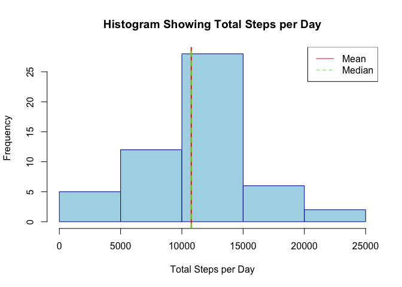
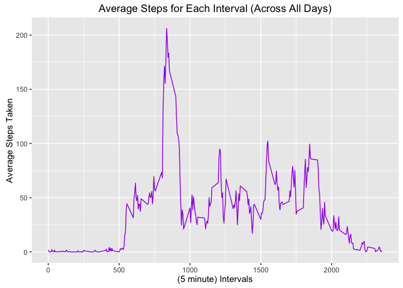
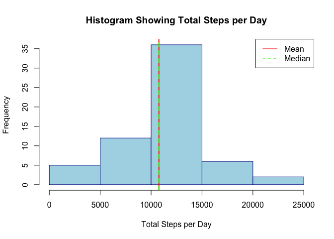
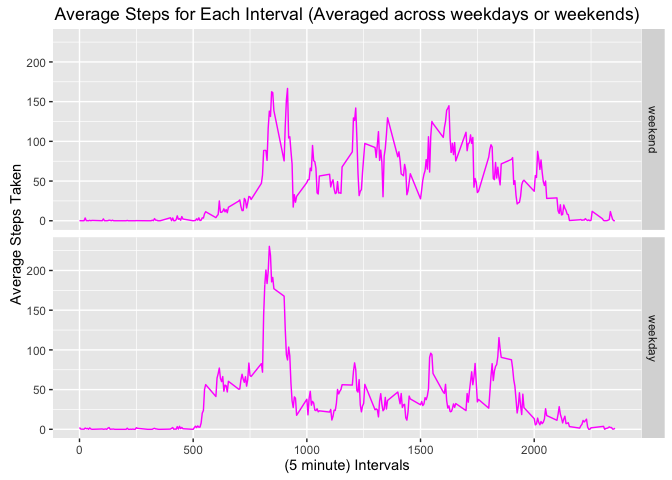

# Reproducible Research Course Project 1 - Activity Monitoring
The dataset used for this report can be found in the Github repository.

Load `knitr` package and set root directory.

```r
library("knitr")
opts_knit$set(root.dir = "~/Coursera/ReproducibleResearch/Week2/RepData_PeerAssessment1")
```

Unzip and then read the csv file.


```r
unzip("activity.zip")
activitydf <- read.csv("activity.csv")
```

Briefly explore the data.


```r
head(activitydf)
```

```
##   steps       date interval
## 1    NA 2012-10-01        0
## 2    NA 2012-10-01        5
## 3    NA 2012-10-01       10
## 4    NA 2012-10-01       15
## 5    NA 2012-10-01       20
## 6    NA 2012-10-01       25
```

```r
summary(activitydf)
```

```
##      steps                date          interval     
##  Min.   :  0.00   2012-10-01:  288   Min.   :   0.0  
##  1st Qu.:  0.00   2012-10-02:  288   1st Qu.: 588.8  
##  Median :  0.00   2012-10-03:  288   Median :1177.5  
##  Mean   : 37.38   2012-10-04:  288   Mean   :1177.5  
##  3rd Qu.: 12.00   2012-10-05:  288   3rd Qu.:1766.2  
##  Max.   :806.00   2012-10-06:  288   Max.   :2355.0  
##  NA's   :2304     (Other)   :15840
```

```r
str(activitydf)
```

```
## 'data.frame':	17568 obs. of  3 variables:
##  $ steps   : int  NA NA NA NA NA NA NA NA NA NA ...
##  $ date    : Factor w/ 61 levels "2012-10-01","2012-10-02",..: 1 1 1 1 1 1 1 1 1 1 ...
##  $ interval: int  0 5 10 15 20 25 30 35 40 45 ...
```

###What is the mean total number of steps taken per day?

Calculate total number of steps per day (including NA values).


```r
total_steps_per_day <- aggregate(activitydf$steps,   by=list(date=activitydf$date), FUN=sum)
```

Make a histogram of total number of steps per day. Calculate and report the mean and median of the total number of steps taken per day.


```r
plot1 <- hist(total_steps_per_day$x, col = "lightblue", border = "darkblue", main="Histogram Showing Total Steps per Day",xlab="Total Steps per Day")
abline(v = mean(total_steps_per_day$x, na.rm = TRUE), col="red", lwd=2, lty=1)
abline(v = median(total_steps_per_day$x, na.rm = TRUE), col="green", lwd=2, lty=2)
legend(x = "topright", c("Mean", "Median"), col = c("red", "green"), lwd = c(1, 1), lty = c(1, 2))
```

<!-- -->

```r
mean(total_steps_per_day$x, na.rm = TRUE)
```

```
## [1] 10766.19
```

```r
median(total_steps_per_day$x, na.rm = TRUE)
```

```
## [1] 10765
```

Output for frequency totals.


```r
plot1$counts
```

```
## [1]  5 12 28  6  2
```

###What is the average daily activity pattern?
Make a time series plot (i.e. 𝚝𝚢𝚙𝚎 = "𝚕") of the 5-minute interval (x-axis) and the average number of steps taken, averaged across all days (y-axis).

Calculate average steps taken for each interval across all days.


```r
ave_steps_per_interval <- aggregate(activitydf$steps, by=list(interval=activitydf$interval), FUN=mean, na.rm = TRUE)
```

Here's a time series (line) plot using ggplot2.


```r
library(ggplot2)
plot2 <- ggplot(ave_steps_per_interval, aes(interval, x)) 
plot2 + geom_line(color = "purple") +
ggtitle("Average Steps for Each Interval (Across All Days)") + ylab("Average Steps Taken") +
xlab("(5 minute) Intervals")
```

<!-- -->

Which 5-minute interval, on average across all the days in the dataset, contains the maximum number of steps?


```r
ave_steps_per_interval[which.max(ave_steps_per_interval[,2]),1]
```

```
## [1] 835
```

###Imputing missing values

Calculate and report the total number of missing values in the dataset (i.e. the total number of rows with 𝙽𝙰.s)


```r
sum(is.na(activitydf))
```

```
## [1] 2304
```

Create a new dataset that is equal to the original dataset but with the missing data filled in. 

I have chosen to fill in the missing values with the mean for that five minute interval.


```r
library(dplyr)
```

```
## 
## Attaching package: 'dplyr'
```

```
## The following objects are masked from 'package:stats':
## 
##     filter, lag
```

```
## The following objects are masked from 'package:base':
## 
##     intersect, setdiff, setequal, union
```

```r
complete_activitydf <- activitydf %>% 
             group_by(interval) %>% 
             mutate(steps= ifelse(is.na(steps), mean(steps, na.rm=TRUE), steps))
```

Make a histogram of the total number of steps taken each day. Calculate and report the mean and median total number of steps taken per day. Do these values differ from the estimates from the first part of the assignment? What is the impact of imputing missing data on the estimates of the total daily number of steps?


```r
total_steps_per_day1 <- aggregate(complete_activitydf$steps, by=list(date=complete_activitydf$date), FUN=sum)
```


```r
plot3 <- hist(total_steps_per_day1$x, col = "lightblue", border = "darkblue", main="Histogram Showing Total Steps per Day",xlab="Total Steps per Day")
abline(v = mean(total_steps_per_day$x, na.rm = TRUE), col="red", lwd=2, lty=1)
abline(v = median(total_steps_per_day$x, na.rm = TRUE), col="green", lwd=2, lty=2)
legend(x = "topright", c("Mean", "Median"), col = c("red", "green"), lwd = c(1, 1), lty = c(1, 2))
```

<!-- -->

```r
mean(total_steps_per_day1$x, na.rm = TRUE)
```

```
## [1] 10766.19
```

```r
median(total_steps_per_day1$x, na.rm = TRUE)
```

```
## [1] 10766.19
```

Output for frequency totals.


```r
plot3$counts
```

```
## [1]  5 12 36  6  2
```

The impact of imputing missing data on the estimates of the total daily number of steps is very minimal.  When comparing the two histograms, there is a slightly higher frequency of 10000 - 15000 steps per day when the missing values are imputed, and the mean and median values are very similar for both histograms.  

###Are there differences in activity patterns between weekdays and weekends?

Create a new factor variable in the dataset with two levels – “weekday” and “weekend” indicating whether a given date is a weekday or weekend day.


```r
# Convert date variable to date class
complete_activitydf$date <- as.Date(complete_activitydf$date)
# Create a weekdays vector
weekday_days <- c("Monday", "Tuesday", "Wednesday", "Thursday", "Friday")
#create a logical vector, convert to a factor and name the levels and labels
complete_activitydf$day.type <- factor((weekdays(complete_activitydf$date) %in% weekday_days), 
         levels=c(FALSE, TRUE), labels=c("weekend", "weekday"))
```

Make a panel plot containing a time series plot (i.e. 𝚝𝚢𝚙𝚎 = "𝚕") of the 5-minute interval (x-axis) and the average number of steps taken, averaged across all weekday days or weekend days (y-axis)


```r
# Calculate average number of steps taken averaged across all weekday days or weekend days
ave_steps_per_interval_wday <- aggregate(complete_activitydf$steps, list(interval=complete_activitydf$interval, day.type = complete_activitydf$day.type), mean)
```


```r
plot4 <- ggplot(ave_steps_per_interval_wday, aes(interval, x))
plot4 + geom_line(color = "magenta") +
ggtitle("Average Steps for Each Interval (Averaged across weekdays or weekends)") + 
ylab("Average Steps Taken") +
facet_grid(day.type~.) + xlab("(5 minute) Intervals")
```

<!-- -->


```r
sessionInfo()
```

```
## R version 3.3.1 (2016-06-21)
## Platform: x86_64-apple-darwin13.4.0 (64-bit)
## Running under: OS X 10.11.6 (El Capitan)
## 
## locale:
## [1] en_GB.UTF-8/en_GB.UTF-8/en_GB.UTF-8/C/en_GB.UTF-8/en_GB.UTF-8
## 
## attached base packages:
## [1] stats     graphics  grDevices utils     datasets  methods   base     
## 
## other attached packages:
## [1] dplyr_0.5.0   ggplot2_2.1.0 knitr_1.14   
## 
## loaded via a namespace (and not attached):
##  [1] Rcpp_0.12.6      magrittr_1.5     munsell_0.4.3    colorspace_1.2-6
##  [5] R6_2.1.2         stringr_1.0.0    plyr_1.8.4       tools_3.3.1     
##  [9] grid_3.3.1       gtable_0.2.0     DBI_0.4-1        htmltools_0.3.5 
## [13] yaml_2.1.13      lazyeval_0.2.0   digest_0.6.10    assertthat_0.1  
## [17] tibble_1.1       reshape2_1.4.1   formatR_1.4      evaluate_0.9    
## [21] rmarkdown_1.0    labeling_0.3     stringi_1.1.1    scales_0.4.0
```
